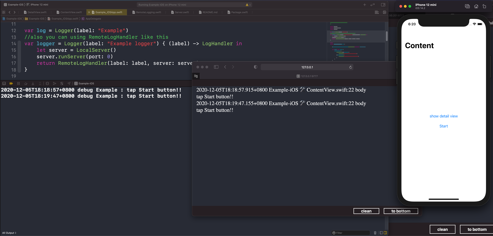

# RemoteLogging

RemoteLogging is a print log in the web page framework for iOS,macOS and tvOS written in Swift.

### Platforms

- iOS 9.0+
- tvOS 9.0+
- macOS 10.10+

## Installation

### Swift Package Manager

The Swift Package Manager is a tool for automating the distribution of Swift code.

Xcode 11 or later has integrated support for the Swift Package Manager. You can add RemoteLogging to your project by choosing the File - Swift Packages - Add Package Dependency option. Use the repository url as specified below and select the version you want to use.

Or you can manually add a Package.swift file to your project with:

```swift
dependencies: [
    .package(url: "https://github.com/E13Lau/RemoteLogging.git")
]
```

### Cocoapods

```ruby
pod "RemoteLoggingKit"
```

## Usage

you can using RemoteLogHandler like this

```swift
var logger = Logger(label: "Example logger") { (label) -> LogHandler in
    let server = LocalServer()
    server.runServer(port: 50113)
    return RemoteLogHandler(label: label, server: server)
}
logger.debug("🎉")
```

then open link: `http://{device hostname or ip address}:50113/`  .Log will be print in the web site.

Alternatively, you can set default logger globally using the LoggingSystem.bootstrap() method.

```swift
LocalServer.default.runServer()
LoggingSystem.bootstrap { (label) -> LogHandler in
    var handler = MultiplexLogHandler([
        RemoteLogHandler(label: label, server: LocalServer.default),
        StreamLogHandler.standardOutput(label: label),
    ])
    handler.logLevel = .trace
    return handler
}
```
After doing this, any subsequent Logger instances created using the Logger(label:) initializer will default to the specified handler.

```swift
var log = Logger(label: "Example")
log.debug("🎉")
```

LocalServer.default is a static http server, default port is 9777

then open link: `http://{device hostname or ip address}:9777/`  .Log will be print in the web page.



## TODO

- [x] support cocoapods
- [ ] filter log
- [ ] beautify log

## License

RemoteLogging is released under the MIT license.

--------------

## 中文说明

RemoteLoggingKit 是一个使用 Swift 编写的可以通过 web 页面查看 App 的调试日志。

### 支持平台

- iOS 9.0+
- tvOS 9.0+
- macOS 10.10+

## 安装

### Swift Package Manager

Swift软件包管理器是用于自动分发Swift代码的工具。

Xcode 11 or later has integrated support for the Swift Package Manager. You can add RemoteLogging to your project by choosing the File - Swift Packages - Add Package Dependency option. Use the repository url as specified below and select the version you want to use.

Or you can manually add a Package.swift file to your project with:

```swift
dependencies: [
    .package(url: "https://github.com/E13Lau/RemoteLogging.git")
]
```

### Cocoapods

```ruby
pod "RemoteLoggingKit"
```

## 使用

你可以像这样来使用

```swift
var logger = Logger(label: "Example logger") { (label) -> LogHandler in
    let server = LocalServer()
    server.runServer(port: 50113)
    return RemoteLogHandler(label: label, server: server)
}
logger.debug("🎉")
```
然后局域网内任意机器打开链接 `http://{调试设备的 hostname 或者 IP地址}:50113/` 调试日志会显示在页面上。

或者，你可以使用 LoggingSystem.bootstrap() 函数配置全局默认 LogHandler。

```swift
LocalServer.default.runServer()
LoggingSystem.bootstrap { (label) -> LogHandler in
        var handler = MultiplexLogHandler([
        RemoteLogHandler(label: label, server: LocalServer.default),
        StreamLogHandler.standardOutput(label: label),
    ])
    handler.logLevel = .trace
    return handler
}
```

完成此操作后，使用 Logger(label :) 初始化程序创建的任何后续Logger实例将默认为指定的处理程序。

```swift
var log = Logger(label: "Example")
log.debug("🎉")
```

LocalServer.default 是一个静态 http 服务，默认端口为 9777
然后局域网内任意机器打开链接 `http://{调试设备的 hostname 或者 IP地址}:50113/` 调试日志会显示在页面上。
