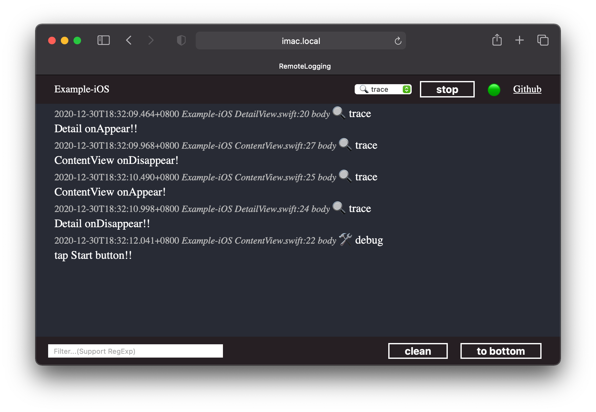

# RemoteLogging

RemoteLogging is a print log in web framework for iOS,macOS and tvOS written in Swift.

### Platforms

- iOS 9.0+
- tvOS 9.0+
- macOS 10.10+

## Installation

### Swift Package Manager

The Swift Package Manager is a tool for automating the distribution of Swift code.

Xcode 11 or later has integrated support for the Swift Package Manager. You can add RemoteLogging to your project by choosing the File - Swift Packages - Add Package Dependency option. Use the repository url as specified below and select the version you want to use.

Or you can manually add a Package.swift file to your project with:

```swift
dependencies: [
    .package(url: "https://github.com/E13Lau/RemoteLogging.git")
]
```

## Usage


you can using RemoteLogHandler like this

```swift
var logger = Logger(label: "Example logger") { (label) -> LogHandler in
    let server = LocalServer()
    server.runServer(port: 50113)
    return RemoteLogHandler(label: label, server: server)
}
logger.debug("🎉")
```
then open link: `http://{device hostname or ip address}:50113/`  .Log will be print in web page.

Alternatively, you can set default logger globally using the LoggingSystem.bootstrap() method.

```swift
LocalServer.default.runServer()
LoggingSystem.bootstrap { (label) -> LogHandler in
    var handler = MultiplexLogHandler([
        RemoteLogHandler(label: label, server: LocalServer.default),
        StreamLogHandler.standardOutput(label: label),
    ])
    handler.logLevel = .trace
    return handler
}
```
After doing this, any subsequent Logger instances created using the Logger(label:) initializer will default to the specified handler.

```swift
var log = Logger(label: "Example")
log.debug("🎉")
```

LocalServer.default is a static http server, default port is 9777

then open link: `http://{device hostname or ip address}:9777/`  .Log will be print in web page.



## License

RemoteLogging is released under the MIT license.